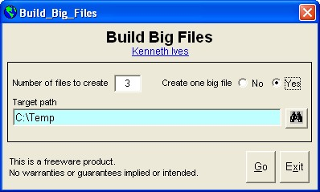



## Build big test files  30\-Mar\-2012

### Description

Ever have the need for a big test file? Now you can build one or more 1gb in size with the option to combine them into one very large file.

=== 30-Mar-2012 Updated documentation. Added modTrimStr.bas module.
 
### More Info
 

             |
---                |---
**Submitted On**   |2012-03-28 08:23:56
**By**             |[Kenaso](https://github.com/Planet-Source-Code/PSCIndex/blob/master/ByAuthor/kenaso.md)
**Level**          |Beginner
**User Rating**    |5.0 (10 globes from 2 users)
**Compatibility**  |VB 6\.0
**Category**       |[Files/ File Controls/ Input/ Output](https://github.com/Planet-Source-Code/PSCIndex/blob/master/ByCategory/files-file-controls-input-output__1-3.md)
**World**          |[Visual Basic](https://github.com/Planet-Source-Code/PSCIndex/blob/master/ByWorld/visual-basic.md)
**Archive File**   |[Build\_big\_2222293292012\.zip](https://github.com/Planet-Source-Code/kenaso-build-big-test-files-30-mar-2012__1-70835/archive/master.zip)

